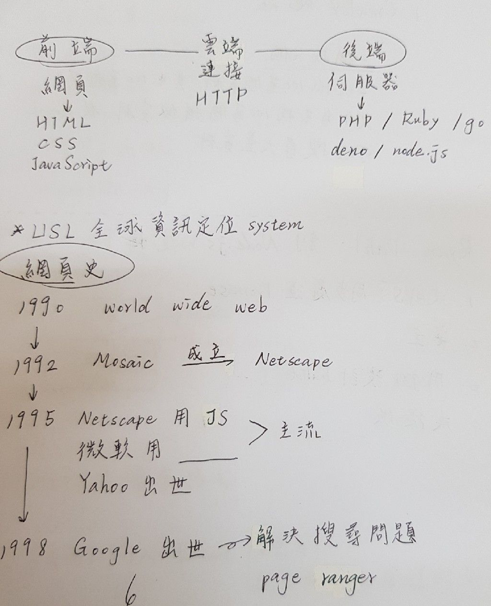

# 網頁設計進階9/18

## 前言
> 網頁 網站，差在是否有伺服器

> 

## USL全球資訊定位系統
### ※網頁史 
>1990  world wide web 
> 
>1992  Mosaic 成立 Netscape 
> 
>1995  Netscape用JS （主流）  微軟用VS （主流）  Yahoo出世 
>
>1998  Google 出世 解決搜尋問題（page ranger） 
 
### ※為何可以搜尋到我們沒上傳的資料 
>因為Crawler爬蟲 要一個找一個 
>一次抓100萬個資料，其中100萬個資料又各自去找100萬個相似資料 
>使Google可以搜尋大量資料 
 
### ※Ryan Dahl 創 Node.js 後悔 
>1. 沒用JS同步處理Promise 
>2. 安全 
>3. 用gyp設計Bulid 
>4. 沒提供 
 
>開發與硬體連接：C/C++、Rust 
>開發伺服器: Go 
>用在企業: Java 
>用在AI: python 
>用在網站: JS 

### ※Single thread

> 

### ※筆記
>utf8是檔案格式 
> 
>只要有輸出輸入用await（不容易卡，就算卡住也會讓給別人） 
> 
>server效能才會快，不用Dync會卡
>
>物件 . 函數 console . log
